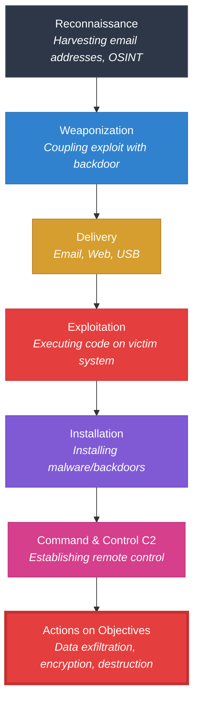
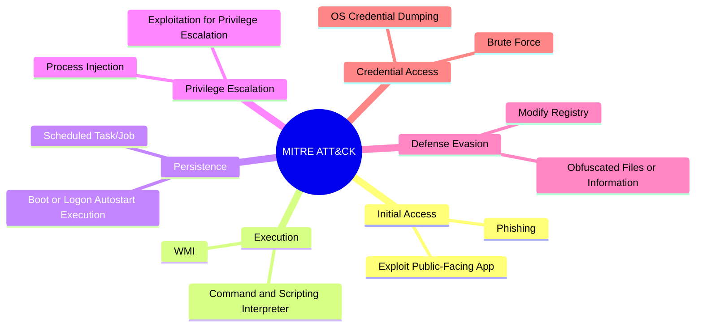
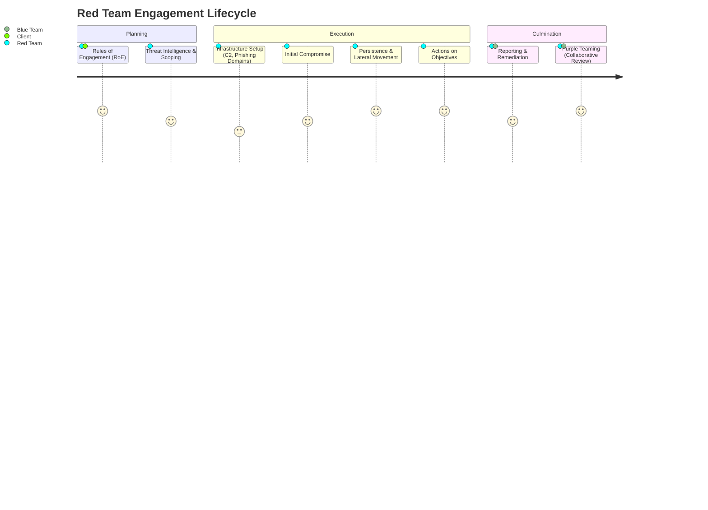

# 🎯 Module 15 – INTRODUCTION TO RED TEAM PLAN AND EXECUTION
 

> [!NOTE]
> **Module Overview:** This module transitions from standard penetration testing into Red Teaming. It covers the fundamental frameworks used to model advanced persistent threats (APTs), including the Cyber Kill Chain and MITRE ATT&CK, as well as the lifecycle and execution phases of a Red Team engagement.

---

## ⛓️ 1. The Cyber Kill Chain

Developed by Lockheed Martin, the Cyber Kill Chain framework models the stages of a cyberattack. Breaking the chain at any point disrupts the attack.

<b>🔍 Expand to view the Cyber Kill Chain Model</b>

 

### Defensive Action Matrix
| Kill Chain Phase | Defensive Action (Example) |
| :--- | :--- |
| **Reconnaissance** | Web analytics monitoring, Firewall logs |
| **Weaponization** | N/A (Happens on attacker's infrastructure) |
| **Delivery** | Proxy filters, Antivirus, Email Security Gateways |
| **Exploitation** | Patch management, Exploit Mitigation (DEP/ASLR) |
| **Installation** | EDR (Endpoint Detection and Response), HIPS |
| **Command & Control** | DNS filtering, Network segmentation, NIDS |
| **Actions on Objectives** | DLP (Data Loss Prevention), Incident Response |

---

## 🧩 2. MITRE ATT&CK Framework

While the Cyber Kill Chain models the *flow* of an attack, the MITRE ATT&CK (Adversarial Tactics, Techniques, and Common Knowledge) framework provides a globally accessible knowledge base of adversary *tactics and techniques* based on real-world observations.

### Tactics vs. Techniques
*   **Tactics (The "Why"):** The adversary's technical goal (e.g., Initial Access, Persistence).
*   **Techniques (The "How"):** How the adversary achieves the tactical goal (e.g., Phishing, Registry Run Keys).
*   **Procedures:** The specific, highly detailed implementation (e.g., APT29 using a specific PowerShell script).

<b>📊 Core ATT&CK Tactics Overview</b>

 

---

## ⚔️ 3. Red Team Phases and Cycle

A Red Team engagement is fundamentally different from a Penetration Test. While a Pentest aims to find *as many vulnerabilities as possible* in a given scope, a Red Team engagement aims to assess the organization's **detection and response capabilities** (the Blue Team) by emulating a real-world threat actor.

### Red Team Lifecycle

> [!TIP]
> **OPSEC (Operational Security):** During a Red Team engagement, avoiding detection is paramount. Attackers (and Red Teamers) use proxies, redirectors, and carefully crafted payloads to bypass EDR/SIEM solutions.

---

## 🔬 4. TryHackMe Research Rooms

To further your understanding of Red Teaming concepts, complete the following practical research rooms:

1.  **Red Team Fundamentals:** [https://tryhackme.com/room/redteamfundamentals](https://tryhackme.com/room/redteamfundamentals)
    *   *Focus:* Differences between Red, Blue, and Purple teams; Introduction to OPSEC.
2.  **Red Team Engagements:** [https://tryhackme.com/room/redteamengagements](https://tryhackme.com/room/redteamengagements)
    *   *Focus:* Scoping, Rules of Engagement (RoE), defining objectives, and reporting.

---

## ⚖️ 5. Red Teaming vs. Penetration Testing Phases

It is critical to understand the difference between standard PT phases and Red Teaming phases.

| Feature | Penetration Testing | Red Teaming |
| :--- | :--- | :--- |
| **Primary Goal** | Find as many vulnerabilities as possible. | Test the organization's detection & response (Blue Team). |
| **Scope** | Usually restricted to specific apps/networks. | Often wide-open ("Assume Breach", physical, social engineering). |
| **Stealth (OPSEC)**| Low priority. Scanners (Nmap, Nessus) are loud. | High priority. Must emulate APT stealth techniques. |
| **Duration** | 1 to 3 weeks. | 1 to 3 months (or longer). |
| **Deliverable** | Vulnerability report and remediation steps. | Attack narrative, timeline, and Blue Team detection analysis. |

 

<i>End of Module 15</i>

